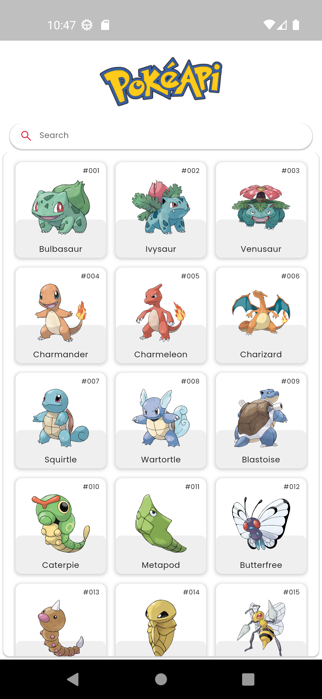
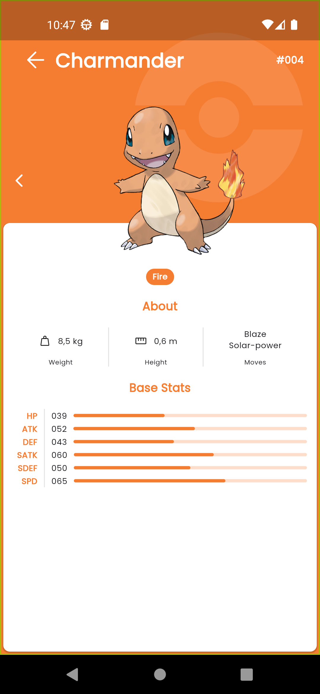
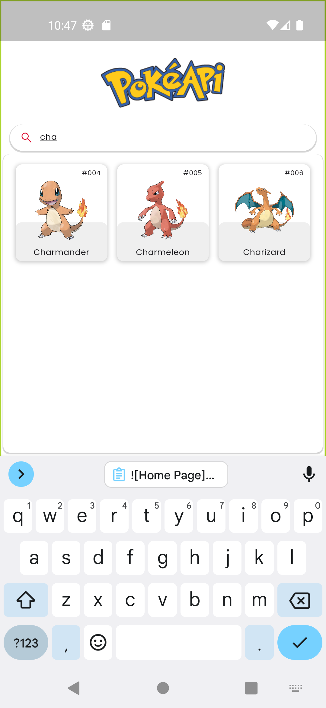

# Pokedex Flutter App

This project is a Pokedex test app developed in Flutter that allows users to browse a list of Pokémon and view details about each one. The app uses the Pokémon API (PokeAPI - https://pokeapi.co/docs/v2) to obtain real-time information about Pokémon, including their name, number, height, weight and types (etc).

## Used technology

- Flutter: An open source mobile application development framework.
- Bloc: A state management library for Flutter.
- PokeAPI: The official Pokémon API used to obtain real-time Pokémon data.

## Facility

1. Clone this repository.
2. Open the project in Flutter.
3. Run the app on your emulator or device.

## Screenshot

